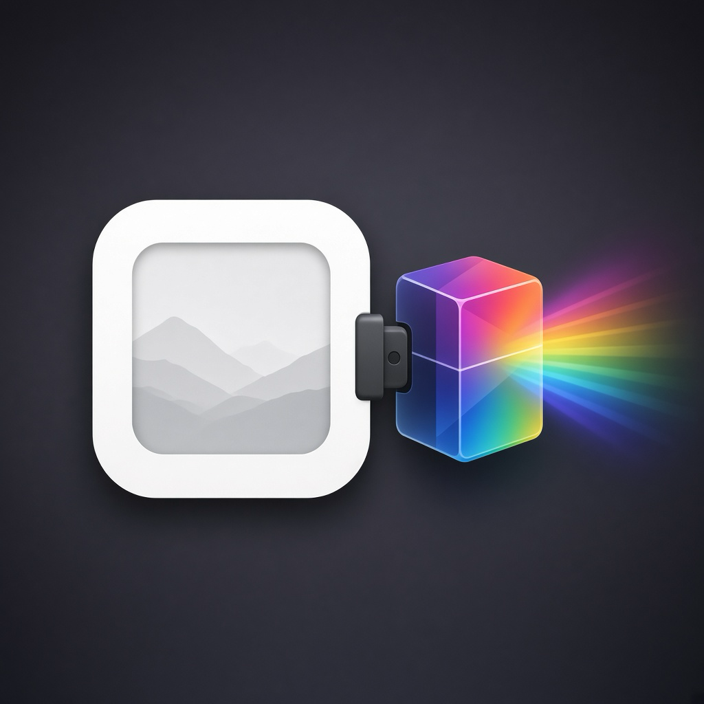
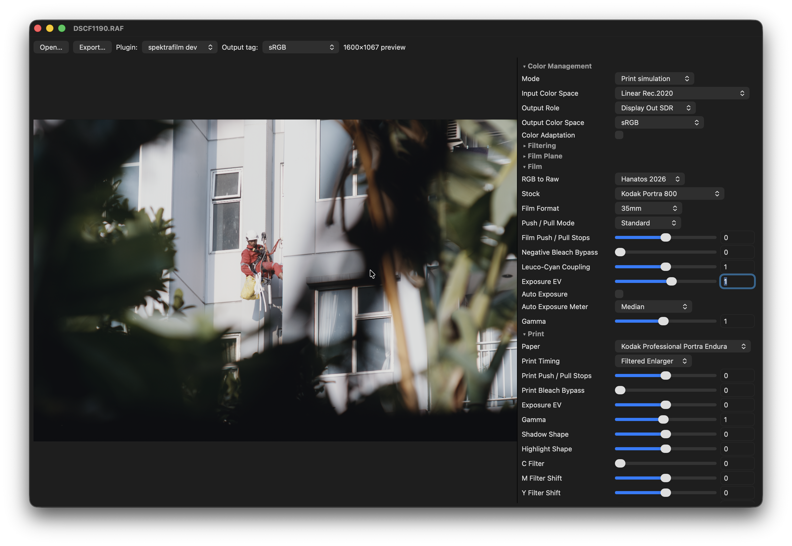

<p align="center">
  
</p>

# OFX Raw Host

[](https://github.com/aaronmurniadi/ofxrawhost/releases/latest)


<a href="https://www.buymeacoffee.com/aaronmurniadi"></a>

A minimal still-image [OpenFX](https://github.com/AcademySoftwareFoundation/openfx) **plugin host**.
Open a RAW (or PNG/JPEG/TIFF/EXR) photo, run it through one or more OFX filter plugins, preview the result,
and export to PNG or JPEG — no video NLE required.

Use it to try OFX effects that normally only run inside Resolve, Nuke, or similar hosts,
on still photos and a simple processing chain.



---

## Tested OFX plugins

| Plugin              | What it does                                                                                                                                                                                                    | Link                                                                                                                         |
| ------------------- | --------------------------------------------------------------------------------------------------------------------------------------------------------------------------------------------------------------- | ---------------------------------------------------------------------------------------------------------------------------- |
| **spektrafilm-ofx** | Film simulation (film, print, scan, grain, halation, diffusion)                                                                                                                                                 | [chaert-s/spektrafilm-ofx](https://github.com/chaert-s/spektrafilm-ofx) / [spektrafilm.114c.de](https://spektrafilm.114c.de) |
| **ntsc-rs**         | Analog video / VHS-style effects                                                                                                                                                                                | [valadaptive/ntsc-rs](https://github.com/valadaptive/ntsc-rs)                                                                |
| **purzOS**          | A collection of 64 native OpenFX video plugins for DaVinci Resolve, Natron, and any other OFX host — retro/analog looks, pixelart, glitch, datamosh, CRT/VHS signal artifacts, colour grades and optical warps. | [purzbeats/purzos-ofx](https://github.com/purzbeats/purzos-ofx)                                                              |

Other OFX filter plugins should work 🤞 If you confirm one, a PR to this table is welcome.

---

## Bundled plugins

### Transform

A bundled OFX plugin that crops, rotates, and zooms the image. Intended at the **beginning of a plugin
chain** so downstream plugins process fewer pixels, it implements `getRegionOfDefinition` to report
the output dimensions directly to the host.

**Parameters:**

- **Crop** — crop amount from 0 to 100, default 0. At 0 the plugin outputs the full image (identity). At 100 the region is 2% of the source in each dimension, which is 0.04% of the source area.
- **Aspect Ratio** — crop window aspect ratio. The list holds landscape ratios: _Original_ (source ratio), _1:1 (Square)_, _6:5 (Photo)_, _5:4 (Large Format)_, _4:3 (Classic TV)_, _1.37:1 (Academy)_, _7:5 (Photo)_, _1.43:1 (IMAX)_, _3:2 (Film Landscape)_, _16:10 (Widescreen)_, _1.66:1 (Super 16)_, _5:3 (Wide)_, _7:4 (Wide)_, _16:9 (Widescreen)_, _1.85:1 (Cinema Flat)_, _2:1 (Univisium)_, _21:9 (Ultrawide)_, _2.39:1 (Anamorphic)_, _3:1 (Panorama)_, and _4:1 (Extreme Wide)_. The default is _Original_.
- **Orientation** — _Landscape_ or _Portrait_, default _Landscape_. Portrait swaps the width and height of the chosen aspect ratio. _Original_ keeps the source shape and ignores this parameter.
- **Zoom** — magnification inside the crop window, from 1 to 1000, default 100. 100 samples the crop window at 1:1. Higher values sample a smaller source region and magnify; lower values sample a wider region and shrink. The output size does not change.
- **Rotate** — rotate the cropped image about its center, in degrees, from -180 to 180, default 0. The crop window stays the output size; the image scales up as needed so the frame stays filled (straight edges, no black corner wedges).
- **Offset X / Offset Y** — pan the crop window from -100 to 100, default 0. At ±100 the window reaches the corresponding source edge. When the crop window fills the source in a dimension (e.g. a portrait aspect ratio on a wider source fills the height), the offset can slide the window **past** the source edge. The out-of-bounds area is filled with **black pixels**.

---

## Install (macOS)

Download the DMG for your Mac from [Releases](https://github.com/aaronmurniadi/ofxrawhost/releases/latest):

- **Apple Silicon (M1 and later):** `OfxRawHost-macOS-arm64.dmg`
- **Intel:** `OfxRawHost-macOS-x86_64.dmg`

Open it and drag **OfxRawHost** onto **Applications**.
The app is ad-hoc signed, so on first launch right-click it and choose **Open**, or run:

```sh
xattr -dr com.apple.quarantine /Applications/OfxRawHost.app
```

---

## Installing OFX plugins

OFX Raw Host loads plugins from the platform default OFX directory plus any paths in `OFX_PLUGIN_PATH`:

| Platform | Default path                                |
| -------- | ------------------------------------------- |
| macOS    | `/Library/OFX/Plugins`                      |
| Linux    | `/usr/OFX/Plugins`                          |
| Windows  | `C:\Program Files\Common Files\OFX\Plugins` |

Install plugins the way their authors recommend (installer, package, or copy `*.ofx.bundle`
into the directory above). For example on macOS:

```sh
sudo mkdir -p /Library/OFX/Plugins
sudo cp -R path/to/*.ofx.bundle /Library/OFX/Plugins/
```

Or point the host at a build directory without copying (apps launched from Finder
don't see shell variables, so start it from the terminal):

```sh
OFX_PLUGIN_PATH=/path/to/plugins /Applications/OfxRawHost.app/Contents/MacOS/OfxRawHost
```

Restart OFX Raw Host after installing plugins. If none are found, the status bar says so.

---

## Build

Requires CMake 3.16+, a C++17 compiler, [LibRaw](https://www.libraw.org/),
[libtiff](https://libtiff.gitlab.io/libtiff/), and
[Little CMS 2](https://www.littlecms.com/).
GLFW and Dear ImGui are fetched automatically by CMake.

```sh
# macOS
brew install cmake libraw libtiff little-cms2

# Debian/Ubuntu
sudo apt install cmake pkg-config libraw-dev libtiff-dev liblcms2-dev libgl1-mesa-dev xorg-dev

git clone --recursive https://github.com/aaronmurniadi/ofxrawhost.git
cd ofxrawhost
./build.sh
```

On macOS this produces `build/OfxRawHost.app`. Elsewhere, `build/OfxRawHost`.

```sh
# Enable native CPU instructions (AVX, F16C, etc.) for extra speed
OFX_NATIVE_ARCH=1 ./build.sh

# macOS self-test
build/OfxRawHost.app/Contents/MacOS/OfxRawHost --selftest

# Linux / Windows
build/OfxRawHost --selftest
```

---

## Development Roadmap

| Feature                                                             | Status         |
| ------------------------------------------------------------------- | -------------- |
| C++17 + Dear ImGui UI (cross-platform codebase)                     | Done (v0.2)    |
| Plugin chaining with reorder / bypass                               | Done (v0.3)    |
| Preview zoom / pan                                                  | Done (v0.3.2)  |
| TIFF open via libtiff (incl. half float)                            | Done (v0.3.3)  |
| Selectable ImGui themes (Photoshop default)                         | Done (v0.3.4)  |
| Performance: ICC caching, LTO, multithreaded resize, pooled buffers | Done (v0.3.5)  |
| Auto-detect input color space (ICC / RAW policy)                    | Done (v0.3.6)  |
| Workspace folder + filmstrip thumbnails                             | Done (v0.3.7)  |
| Project / sidecar JSON (reproducible chain + export metadata)       | Done (v0.3.7)  |
| ImGui DockSpace layout + modular UI modules                         | Done (v0.3.7)  |
| Layered source layout (`imgio` / `ofx` / `persist` / `ui`)          | Done (v0.3.8)  |
| Correct JPEG/PNG passthrough preview color                          | Done (v0.3.8)  |
| Cached display buffer + Output tag recolor without re-render        | Done (v0.3.9)  |
| OFX multi-thread worker pool                                        | Done (v0.3.9)  |
| Open dialog / workspace filters (exclude sidecar JSON)              | Done (v0.3.9)  |
| OFX Metal GPU render support (spektrafilm diffuse/flow)             | Done (v0.3.10) |
| Selftest validation + performance instrumentation                   | Done (v0.3.10) |
| Fix OFX Metal render readback (blank spektrafilm output)            | Done (v0.3.11) |
| Click-to-step −/+ buttons on numeric parameter sliders              | Done (v0.3.11) |
| Code cleanup: dedupe helpers, split Actions module, drop dead code  | Done (v0.3.12) |
| Race fixes: idle wait, export gate, atomic tag, locked dims/params  | Done (v0.3.12) |
| ThreadSanitizer-clean concurrency + concurrency selftest            | Done (v0.3.12) |
| Refactor: JsonValue, RenderSchedule, GlTexture, ChainRenderer       | Done (v0.3.13) |
| Refactor: ParamType enum replaces repeated OFX type compares        | Done (v0.3.13) |
| Refactor: one image format table; shared extension helpers          | Done (v0.3.13) |
| Refactor: self-test cases move to `src/selftest/Selftest.cpp`       | Done (v0.3.13) |
| Metal scratch buffers reused per instance across renders            | Done (v0.3.13) |
| Correct Crop parameter docs: aspect list, amount, offsets           | Done (v0.3.13) |
| Performance: chained Metal GPU render skips per-node copies         | Done (v0.3.14) |
| Performance: parameter panel uses cached metadata                   | Done (v0.3.14) |
| Performance: filmstrip clips off-screen entries, O(1) lookup        | Done (v0.3.14) |
| Performance: progressive preview draws a draft then full res        | Done (v0.3.15) |
| Performance: async PBO display texture upload                       | Done (v0.3.15) |
| Performance: parallel display color conversion                      | Done (v0.3.15) |
| Bundled plugin: Crop becomes Transform (orientation, zoom, rotate)  | Done (v0.3.16) |
| Transform rotates with cover-scale so the frame has no black wedges | Done (v0.3.16) |
| Transform samples bilinearly with clamped edge pixels               | Done (v0.3.16) |
| Parameter widgets honor the OFX increment; wide ranges use drag     | Done (v0.3.16) |
| Packaged Windows and Linux releases                                 | Planned        |

---

## License

See [LICENSE](LICENSE). The OpenFX SDK in `third_party/openfx` (git submodule) is under its own license. Vendored headers under `third_party/stb`, `third_party/tinyexr`, `third_party/portable-file-dialogs`, and `third_party/fontawesome` keep their upstream licenses. UI themes in `src/ui/Themes.cpp` are from [ImThemes](https://github.com/Patitotective/ImThemes) (MIT).
