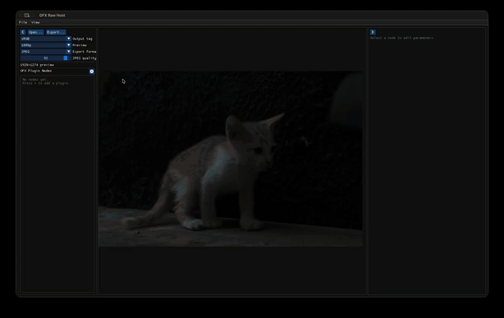

<p align="center">
  
</p>

# OFX Raw Host

[](https://github.com/aaronmurniadi/ofxrawhost/releases/latest)


<a href="https://www.buymeacoffee.com/aaronmurniadi"></a>

A minimal still-image [OpenFX](https://github.com/AcademySoftwareFoundation/openfx) **plugin host**. Open a RAW (or PNG/JPEG/TIFF/EXR) photo, run it through one or more OFX filter plugins, preview the result, and export to TIFF, PNG, JPEG, or OpenEXR — no video NLE required.

Use it to try OFX effects that normally only run inside Resolve, Nuke, or similar hosts, on still photos and a simple processing chain.

> **v0.3.2** adds preview zoom/pan (trackpad pinch + two-finger pan on macOS) and a searchable add-plugin list grouped by author. **v0.3.1** fixed JPEG ICC export and OFX Support plugin loading. **v0.3** added plugin chaining, resizable panels, and icon buttons on the **v0.2** C++17 + Dear ImGui rewrite. Packaged installers are still macOS-only for now.


## Demo



---

## Tested OFX plugins

| Plugin              | What it does                                                    | Link                                                                                                                         |
| ------------------- | --------------------------------------------------------------- | ---------------------------------------------------------------------------------------------------------------------------- |
| **spektrafilm-ofx** | Film simulation (film, print, scan, grain, halation, diffusion) | [chaert-s/spektrafilm-ofx](https://github.com/chaert-s/spektrafilm-ofx) · [spektrafilm.114c.de](https://spektrafilm.114c.de) |
| **ntsc-rs**         | Analog video / VHS-style effects                                | [valadaptive/ntsc-rs](https://github.com/valadaptive/ntsc-rs)                                                                |

Other OFX filter plugins may work. If you confirm one, a PR to this table is welcome.

---

## Install (macOS)

Download the DMG for your Mac from [Releases](https://github.com/aaronmurniadi/ofxrawhost/releases/latest):

- **Apple Silicon (M1 and later):** `OfxRawHost-macOS-arm64.dmg`
- **Intel:** `OfxRawHost-macOS-x86_64.dmg`

Open it and drag **OfxRawHost** onto **Applications**. The app is ad-hoc signed, so on first launch right-click it and choose **Open**, or run:

```sh
xattr -dr com.apple.quarantine /Applications/OfxRawHost.app
```

---

## Installing OFX plugins

OFX Raw Host loads plugins from the platform default OFX directory plus any paths in `OFX_PLUGIN_PATH`:

| Platform | Default path                                |
| -------- | ------------------------------------------- |
| macOS    | `/Library/OFX/Plugins`                      |
| Linux    | `/usr/OFX/Plugins`                          |
| Windows  | `C:\Program Files\Common Files\OFX\Plugins` |

Install plugins the way their authors recommend (installer, package, or copy `*.ofx.bundle` into the directory above). For example on macOS:

```sh
sudo mkdir -p /Library/OFX/Plugins
sudo cp -R path/to/*.ofx.bundle /Library/OFX/Plugins/
```

Or point the host at a build directory without copying (apps launched from Finder don't see shell variables, so start it from the terminal):

```sh
OFX_PLUGIN_PATH=/path/to/plugins /Applications/OfxRawHost.app/Contents/MacOS/OfxRawHost
```

Restart OFX Raw Host after installing plugins. If none are found, the status bar says so.

---

## Build

Requires CMake 3.16+, a C++17 compiler, [LibRaw](https://www.libraw.org/), and [Little CMS 2](https://www.littlecms.com/). GLFW and Dear ImGui are fetched automatically by CMake.

```sh
# macOS
brew install cmake libraw little-cms2

# Debian/Ubuntu
sudo apt install cmake pkg-config libraw-dev liblcms2-dev libgl1-mesa-dev xorg-dev

git clone --recursive https://github.com/aaronmurniadi/ofxrawhost.git
cd ofxrawhost
./build.sh
```

On macOS this produces `build/OfxRawHost.app`. Elsewhere, `build/OfxRawHost`.

```sh
# macOS self-test
build/OfxRawHost.app/Contents/MacOS/OfxRawHost --selftest

# Linux / Windows
build/OfxRawHost --selftest
```

---

## Roadmap

| Feature                                         | Status      |
| ----------------------------------------------- | ----------- |
| C++17 + Dear ImGui UI (cross-platform codebase) | Done (v0.2) |
| Plugin chaining with reorder / bypass           | Done (v0.3) |
| Preview zoom / pan                              | Done (v0.3.2) |
| Packaged Windows and Linux releases             | Planned     |

---

## License

See [LICENSE](LICENSE). The OpenFX SDK in `third_party/openfx` (git submodule) is under its own license. Vendored headers under `third_party/stb`, `third_party/tinyexr`, `third_party/portable-file-dialogs`, and `third_party/fontawesome` keep their upstream licenses.
